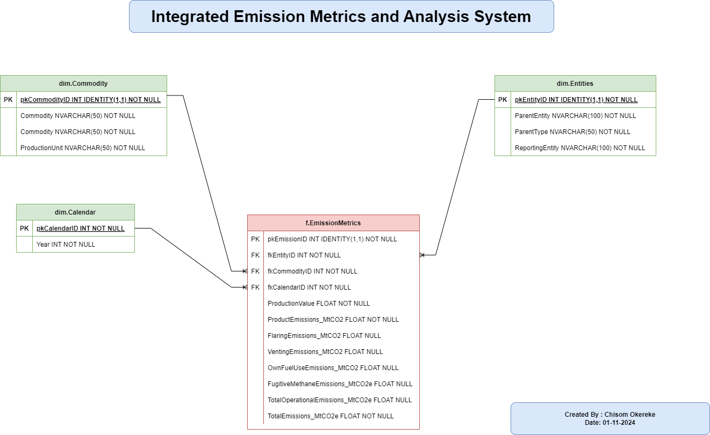

# Datamart Project
Repo for the final project in the data Warehouse design Course. 

You can access the ipynb [here](./Chisom_Okereke_DW_Project.ipynb). 

The mart will be constructed as follows: 

[SQL DDL Template](./data/StarSchemaTemplate.sql)

[SQL DML Loader](./data/DataLoader.sql)  
	  

  
